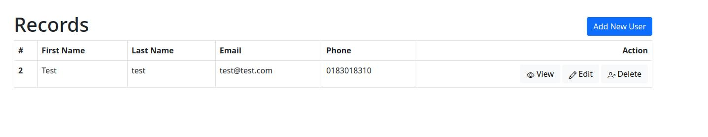
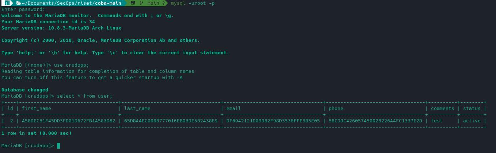

## Requirements and Recommendations

* Nodejs v18.6.0 (untested other versions)
* NPM 8.13.2
* MariaDB 10.8.3, for Linux (x86_64) 

## What Does This Do?

This encrypts and decrypts columns stored in database tables in NodeJS  applications.
by encrypting data as it is stored in the model attributes and decrypting data as it is recalled from the model attributes.

Note:
Encrypted values are usually longer than plain text values.  Sometimes much longer.  You may find that the column widths in your database tables need to be extended to store the encrypted values. 

## Data APP

## Data DB

## Configuration

Add APP_KEY as environment variable to .env file

.env

    APP_KEY = yourkey

## Encryption

#### Node JS

To encrypt before insert/update into database, use helper function from utils/crypt.js. Ex

    import { encrypt } from '@/utils/crypt.js'
    ...
    ...
    const first_name = req.body.first_name
    const query = `INSERT INTO user SET first_name = ${encrypt(first_name)}`

#### SQL Query

    INSERT INTO user
    SET first_name = HEX( AES_ENCRYPT('value', 'your-key') )

## Decrypt

#### Node JS

To get decrypted value from encrypted data, use helper function from utils/crypt.js. Ex

    import { decrypt } from '@/utils/crypt.js'
    ...
    ...
    const query = `SELECT *, ${decrypt('first_name')} FROM user`

#### SQL Query

    SELECT
        *
        DECRYPT( UNHEX(first_name), 'your-key' ) as first_name
    FROM user

Use decrypt in filter

    SELECT
        *
        DECRYPT( UNHEX(first_name), 'your-key' ) as first_name
    FROM user
    WHERE DECRYPT( UNHEX(first_name), 'your-key' ) like '%nama%'
